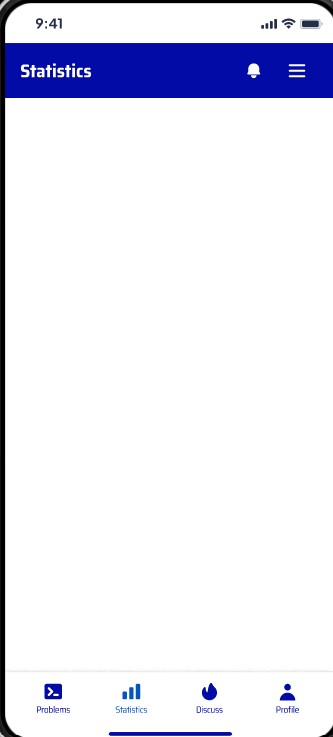

# Ứng dụng di động hỗ trợ cho website luyện tập lập trình CodOcean

Ứng dụng này nhằm mục đích hỗ trợ người dùng truy cập và sử dụng các tính năng của website luyện tập lập trình CodOcean một cách tiện lợi trên thiết bị di động.

## Nhóm phát triển

- **Nguyễn Trường An** - 21110117
- **Nguyễn Văn Hoàng** - 21110828

## Figma Design

Dưới đây là các màn hình chính của ứng dụng được thiết kế trên Figma:

### Màn hình đăng nhập và đăng ký

### Màn hình chính và danh sách bài tập

### Màn hình thảo luận và tạo thảo luận

### Thanh điều hướng và thông báo

### Hồ sơ và thảo luận cá nhân

### Các màn hình khác

Các màn hình này thể hiện giao diện người dùng chính của ứng dụng, bao gồm các chức năng đăng nhập, đăng ký, xem bài tập, thảo luận, quản lý hồ sơ và xem thống kê. Thiết kế tập trung vào tính đơn giản, dễ sử dụng và hiệu quả cho người dùng trên thiết bị di động.

---

## Use Case Diagram

- Đăng ký tài khoản
- **Mô tả**: Người dùng có thể đăng ký tài khoản mới trên ứng dụng bằng cách cung cấp thông tin cá nhân cần thiết.
- **Tác nhân**: Khách vãng lai
- **Tiền điều kiện**: Người dùng chưa có tài khoản trên ứng dụng.
- **Luồng sự kiện chính**:
  1. Người dùng chọn chức năng đăng ký trên giao diện ứng dụng.
  2. Hệ thống hiển thị form đăng ký yêu cầu người dùng nhập thông tin cá nhân (tên, email, mật khẩu, xác nhận mật khẩu).
  3. Người dùng điền đầy đủ thông tin và nhấn nút "Đăng ký".
  4. Hệ thống kiểm tra tính hợp lệ của thông tin (email hợp lệ, mật khẩu khớp nhau, v.v.).
  5. Nếu thông tin hợp lệ, hệ thống tạo tài khoản mới và thông báo đăng ký thành công.
  6. Người dùng có thể đăng nhập vào ứng dụng bằng tài khoản vừa đăng ký.
- **Luồng sự kiện phụ**:
  - 4a. Nếu thông tin không hợp lệ, hệ thống hiển thị thông báo lỗi và yêu cầu người dùng nhập lại thông tin.
- **Ngoại lệ**:
  - E1. Mất kết nối internet:
    1. Hệ thống hiển thị thông báo lỗi kết nối.
    2. Hệ thống yêu cầu người dùng kiểm tra kết nối và thử lại.
  - E2. Email đã được sử dụng:
    1. Hệ thống hiển thị thông báo email đã tồn tại.
    2. Hệ thống yêu cầu người dùng sử dụng email khác hoặc đăng nhập.
  - E3. Lỗi hệ thống:
    1. Hệ thống ghi log lỗi.
    2. Hệ thống hiển thị thông báo lỗi chung và yêu cầu người dùng thử lại sau.

---

---

- Đăng nhập
- **Mô tả**: Người dùng có thể đăng nhập vào ứng dụng bằng tài khoản đã đăng ký.
- **Tác nhân**: Khách hàng, điều hành viên, quản trị viên
- **Tiền điều kiện**: Người dùng đã có tài khoản trên ứng dụng.
- **Luồng sự kiện chính**:
  1. Người dùng chọn chức năng đăng nhập trên giao diện ứng dụng.
  2. Hệ thống hiển thị form đăng nhập yêu cầu người dùng nhập email và mật khẩu.
  3. Người dùng điền đầy đủ thông tin và nhấn nút "Đăng nhập".
  4. Hệ thống kiểm tra tính hợp lệ của thông tin (email và mật khẩu đúng).
  5. Nếu thông tin hợp lệ, hệ thống cho phép người dùng truy cập vào ứng dụng.
  6. Người dùng có thể sử dụng các tính năng của ứng dụng.
- **Luồng sự kiện phụ**:
  - 4a. Nếu thông tin không hợp lệ, hệ thống hiển thị thông báo lỗi và yêu cầu người dùng nhập lại thông tin.
- **Ngoại lệ**:
  - E1. Mất kết nối internet:
    1. Hệ thống hiển thị thông báo lỗi kết nối.
    2. Hệ thống yêu cầu người dùng kiểm tra kết nối và thử lại.
  - E2. Tài khoản bị khóa:
    1. Hệ thống hiển thị thông báo tài khoản bị khóa.
    2. Hệ thống hướng dẫn người dùng liên hệ hỗ trợ để mở khóa tài khoản.
  - E3. Lỗi hệ thống:
    1. Hệ thống ghi log lỗi.
    2. Hệ thống hiển thị thông báo lỗi chung và yêu cầu người dùng thử lại sau.

---

- Kích hoạt tài khoản
- **Mô tả**: Người dùng có thể kích hoạt tài khoản của mình sau khi đăng ký bằng cách sử dụng mã kích hoạt được gửi qua email.
- **Tác nhân**: Khách hàng, điều hành viên, quản trị viên
- **Tiền điều kiện**: Người dùng đã đăng ký tài khoản và nhận được email chứa mã kích hoạt.
- **Luồng sự kiện chính**:
  1. Người dùng mở email và tìm mã kích hoạt được gửi từ hệ thống.
  2. Người dùng mở ứng dụng và đăng nhập.
  3. Hệ thống hiển thị form yêu cầu người dùng nhập mã kích hoạt.
  4. Người dùng nhập mã kích hoạt và nhấn nút "Kích hoạt".
  5. Hệ thống kiểm tra tính hợp lệ của mã kích hoạt.
  6. Nếu mã kích hoạt hợp lệ, hệ thống kích hoạt tài khoản và thông báo thành công.
  7. Người dùng có thể đăng nhập vào ứng dụng bằng tài khoản đã kích hoạt.
- **Luồng sự kiện phụ**:
  - 5a. Nếu mã kích hoạt không hợp lệ, hệ thống hiển thị thông báo lỗi và yêu cầu người dùng nhập lại mã kích hoạt.
- **Ngoại lệ**:
  - E1. Mất kết nối internet:
    1. Hệ thống hiển thị thông báo lỗi kết nối.
    2. Hệ thống yêu cầu người dùng kiểm tra kết nối và thử lại.
  - E2. Mã kích hoạt hết hạn:
    1. Hệ thống hiển thị thông báo mã kích hoạt đã hết hạn.
    2. Hệ thống cung cấp tùy chọn để gửi lại mã kích hoạt mới.
  - E3. Lỗi hệ thống:
    1. Hệ thống ghi log lỗi.
    2. Hệ thống hiển thị thông báo lỗi chung và yêu cầu người dùng thử lại sau.

---

- Quên mật khẩu
- **Mô tả**: Người dùng có thể khôi phục mật khẩu của mình nếu quên bằng cách sử dụng email đã đăng ký.
- **Tác nhân**: Khách hàng, điều hành viên, quản trị viên
- **Tiền điều kiện**: Người dùng đã có tài khoản trên ứng dụng và quên mật khẩu.
- **Luồng sự kiện chính**:
  1. Người dùng chọn chức năng quên mật khẩu trên giao diện ứng dụng.
  2. Hệ thống hiển thị form yêu cầu người dùng nhập email đã đăng ký.
  3. Người dùng nhập email và nhấn nút "Gửi".
  4. Hệ thống kiểm tra tính hợp lệ của email.
  5. Nếu email hợp lệ, hệ thống gửi email chứa liên kết khôi phục mật khẩu cho người dùng.
  6. Người dùng mở email và nhấp vào liên kết khôi phục mật khẩu.
  7. Hệ thống hiển thị form yêu cầu người dùng nhập mật khẩu mới và xác nhận mật khẩu mới.
  8. Người dùng nhập mật khẩu mới và nhấn nút "Xác nhận".
  9. Hệ thống kiểm tra tính hợp lệ của mật khẩu mới.
  10. Nếu mật khẩu mới hợp lệ, hệ thống cập nhật mật khẩu và thông báo thành công.
  11. Người dùng có thể đăng nhập vào ứng dụng bằng mật khẩu mới.
- **Luồng sự kiện phụ**:
  - 5a. Nếu email không hợp lệ, hệ thống hiển thị thông báo lỗi và yêu cầu người dùng nhập lại email.
  - 9a. Nếu mật khẩu mới không hợp lệ, hệ thống hiển thị thông báo lỗi và yêu cầu người dùng nhập lại mật khẩu mới.
- **Ngoại lệ**:
  - E1. Mất kết nối internet:
    1. Hệ thống hiển thị thông báo lỗi kết nối.
    2. Hệ thống yêu cầu người dùng kiểm tra kết nối và thử lại.
  - E2. Email không tồn tại trong hệ thống:
    1. Hệ thống hiển thị thông báo email không tồn tại.
    2. Hệ thống gợi ý người dùng kiểm tra lại email hoặc đăng ký tài khoản mới.
  - E3. Lỗi hệ thống:
    1. Hệ thống ghi log lỗi.
    2. Hệ thống hiển thị thông báo lỗi chung và yêu cầu người dùng thử lại sau.

---

- Nâng cấp tài khoản VIP
- **Mô tả**: Người dùng có thể nâng cấp tài khoản của mình lên tài khoản VIP để sử dụng các tính năng cao cấp của ứng dụng.
- **Tác nhân**: Khách hàng
- **Tiền điều kiện**: Người dùng đã đăng nhập vào ứng dụng.
- **Luồng sự kiện chính**:
  1. Người dùng chọn chức năng nâng cấp tài khoản VIP trên giao diện ứng dụng.
  2. Hệ thống hiển thị các gói VIP và chi tiết về các tính năng cao cấp.
  3. Người dùng chọn gói VIP mong muốn và nhấn nút "Nâng cấp".
  4. Hệ thống hiển thị form yêu cầu người dùng nhập thông tin thanh toán.
  5. Người dùng điền đầy đủ thông tin thanh toán và nhấn nút "Xác nhận".
  6. Hệ thống kiểm tra tính hợp lệ của thông tin thanh toán.
  7. Nếu thông tin thanh toán hợp lệ, hệ thống tiến hành nâng cấp tài khoản và thông báo thành công.
  8. Người dùng có thể sử dụng các tính năng cao cấp của tài khoản VIP.
- **Luồng sự kiện phụ**:
  - 6a. Nếu thông tin thanh toán không hợp lệ, hệ thống hiển thị thông báo lỗi và yêu cầu người dùng nhập lại thông tin thanh toán.
- **Ngoại lệ**:
  - E1. Mất kết nối internet:
    1. Hệ thống hiển thị thông báo lỗi kết nối.
    2. Hệ thống yêu cầu người dùng kiểm tra kết nối và thử lại.
  - E2. Lỗi thanh toán:
    1. Hệ thống hiển thị thông báo lỗi thanh toán.
    2. Hệ thống gợi ý người dùng kiểm tra lại thông tin thanh toán hoặc thử phương thức thanh toán khác.
  - E3. Tài khoản đã là VIP:
    1. Hệ thống hiển thị thông báo tài khoản đã là VIP.
    2. Hệ thống cung cấp tùy chọn để gia hạn hoặc nâng cấp gói VIP hiện tại.
  - E4. Lỗi hệ thống:
    1. Hệ thống ghi log lỗi.
    2. Hệ thống hiển thị thông báo lỗi chung và yêu cầu người dùng thử lại sau.

---

- Quản lý bài toán
- **Mô tả**: Người dùng có thể quản lý các bài toán trên ứng dụng bao gồm tạo, xem, xóa và sửa bài toán.
- **Tác nhân**: Khách hàng, điều hành viên
- **Tiền điều kiện**: Người dùng đã đăng nhập vào ứng dụng.

- Tạo bài toán
- **Luồng sự kiện chính**:
  1. Người dùng chọn chức năng tạo bài toán trên giao diện ứng dụng.
  2. Hệ thống hiển thị form yêu cầu người dùng nhập thông tin bài toán.
  3. Người dùng điền đầy đủ thông tin bài toán và nhấn nút "Tạo".
  4. Hệ thống kiểm tra tính hợp lệ của thông tin bài toán.
  5. Nếu thông tin hợp lệ, hệ thống tạo bài toán mới và thông báo thành công.
- **Luồng sự kiện phụ**:
  - 4a. Nếu thông tin không hợp lệ, hệ thống hiển thị thông báo lỗi và yêu cầu người dùng nhập lại thông tin.
- **Ngoại lệ**:
  - E1. Mất kết nối internet:
    1. Hệ thống hiển thị thông báo lỗi kết nối.
    2. Hệ thống yêu cầu người dùng kiểm tra kết nối và thử lại.
  - E2. Người dùng không có quyền tạo bài toán:
    1. Hệ thống hiển thị thông báo không có quyền tạo bài toán.
    2. Hệ thống hướng dẫn người dùng nâng cấp tài khoản hoặc liên hệ quản trị viên.
  - E3. Lỗi hệ thống:
    1. Hệ thống ghi log lỗi.
    2. Hệ thống hiển thị thông báo lỗi chung và yêu cầu người dùng thử lại sau.

---

- Xem bài toán
- **Luồng sự kiện chính**:
  1. Người dùng chọn chức năng xem bài toán trên giao diện ứng dụng.
  2. Hệ thống hiển thị danh sách các bài toán có sẵn.
  3. Người dùng chọn một bài toán để xem chi tiết.
  4. Hệ thống hiển thị chi tiết bài toán.
- **Luồng sự kiện phụ**:
  - Không có.
- **Ngoại lệ**:
  - E1. Mất kết nối internet:
    1. Hệ thống hiển thị thông báo lỗi kết nối.
    2. Hệ thống yêu cầu người dùng kiểm tra kết nối và thử lại.
  - E2. Bài toán không tồn tại hoặc đã bị xóa:
    1. Hệ thống hiển thị thông báo bài toán không tồn tại.
    2. Hệ thống đưa người dùng trở lại danh sách bài toán.
  - E3. Lỗi hệ thống:
    1. Hệ thống ghi log lỗi.
    2. Hệ thống hiển thị thông báo lỗi chung và yêu cầu người dùng thử lại sau.

---

- Xóa bài toán
- **Luồng sự kiện chính**:
  1. Người dùng chọn chức năng xóa bài toán trên giao diện ứng dụng.
  2. Hệ thống hiển thị danh sách các bài toán đã được người dùng tạo.
  3. Người dùng chọn một bài toán để xóa.
  4. Hệ thống hiển thị thông báo xác nhận xóa bài toán.
  5. Người dùng xác nhận xóa bài toán.
  6. Hệ thống kiểm tra quyền hạn của người dùng.
  7. Nếu người dùng có quyền xóa, hệ thống xóa bài toán và thông báo thành công.
- **Luồng sự kiện phụ**:
  - 6a. Nếu người dùng không có quyền xóa, hệ thống hiển thị thông báo lỗi và không thực hiện xóa bài toán.
- **Ngoại lệ**:
  - E1. Mất kết nối internet:
    1. Hệ thống hiển thị thông báo lỗi kết nối.
    2. Hệ thống yêu cầu người dùng kiểm tra kết nối và thử lại.
  - E2. Bài toán đã được sử dụng trong cuộc thi hoặc bài tập:
    1. Hệ thống hiển thị thông báo không thể xóa bài toán.
    2. Hệ thống giải thích lý do và đề xuất ẩn bài toán thay vì xóa.
  - E3. Lỗi hệ thống:
    1. Hệ thống ghi log lỗi.
    2. Hệ thống hiển thị thông báo lỗi chung và yêu cầu người dùng thử lại sau.

---

- Sửa bài toán
- **Luồng sự kiện chính**:
  1. Người dùng chọn chức năng sửa bài toán trên giao diện ứng dụng.
  2. Hệ thống hiển thị danh sách các bài toán đã được người dùng tạo.
  3. Người dùng chọn một bài toán để sửa.
  4. Hệ thống hiển thị form yêu cầu người dùng chỉnh sửa thông tin bài toán.
  5. Người dùng chỉnh sửa thông tin bài toán và nhấn nút "Lưu".
  6. Hệ thống kiểm tra tính hợp lệ của thông tin bài toán.
  7. Nếu thông tin hợp lệ, hệ thống cập nhật bài toán và thông báo thành công.
- **Luồng sự kiện phụ**:
  - 6a. Nếu thông tin không hợp lệ, hệ thống hiển thị thông báo lỗi và yêu cầu người dùng chỉnh sửa lại thông tin.
- **Ngoại lệ**:
  - E1. Mất kết nối internet:
    1. Hệ thống hiển thị thông báo lỗi kết nối.
    2. Hệ thống yêu cầu người dùng kiểm tra kết nối và thử lại.
  - E2. Người dùng không có quyền sửa bài toán:
    1. Hệ thống hiển thị thông báo không có quyền sửa bài toán.
    2. Hệ thống hướng dẫn người dùng liên hệ quản trị viên nếu cần thiết.
  - E3. Bài toán đang được sử dụng trong cuộc thi đang diễn ra:
    1. Hệ thống hiển thị thông báo không thể sửa bài toán.
    2. Hệ thống giải thích lý do và đề xuất thời điểm có thể sửa sau khi cuộc thi kết thúc.
  - E4. Lỗi hệ thống:
    1. Hệ thống ghi log lỗi.
    2. Hệ thống hiển thị thông báo lỗi chung và yêu cầu người dùng thử lại sau.

---

- Tìm kiếm bài toán
- **Mô tả**: Người dùng có thể tìm kiếm các bài toán có sẵn trên ứng dụng.
- **Tác nhân**: Khách hàng, điều hành viên
- **Tiền điều kiện**: Người dùng đã đăng nhập vào ứng dụng.
- **Luồng sự kiện chính**:
  1. Người dùng vào trang chủ.
  2. Người dùng nhập từ khóa và các tiêu chí lọc vào ô tìm kiếm.
  3. Hệ thống tìm kiếm các bài toán phù hợp với từ khóa và các tiêu chí lọc, sau đó hiển thị danh sách kết quả.
  4. Người dùng chọn một bài toán từ danh sách kết quả để xem chi tiết.
- **Luồng sự kiện phụ**:
  - Không có.
- **Ngoại lệ**:
  - E1. Mất kết nối internet:
    1. Hệ thống hiển thị thông báo lỗi kết nối.
    2. Hệ thống yêu cầu người dùng kiểm tra kết nối và thử lại.
  - E2. Không tìm thấy kết quả:
    1. Hệ thống hiển thị thông báo không tìm thấy bài toán phù hợp.
    2. Hệ thống đề xuất các từ khóa hoặc tiêu chí tìm kiếm khác.
  - E3. Lỗi hệ thống:
    1. Hệ thống ghi log lỗi.
    2. Hệ thống hiển thị thông báo lỗi chung và yêu cầu người dùng thử lại sau.

---

- Làm bài toán
- **Mô tả**: Người dùng có thể làm các bài toán có sẵn trên ứng dụng.
- **Tác nhân**: Khách hàng
- **Tiền điều kiện**: Người dùng đã đăng nhập vào ứng dụng và đã chọn một bài toán từ danh sách.
- **Luồng sự kiện chính**:
  1. Người dùng chọn một bài toán từ danh sách bài toán.
  2. Hệ thống hiển thị chi tiết bài toán và form để người dùng nhập câu trả lời.
  3. Người dùng điền câu trả lời và nhấn nút "Submit".
  4. Hệ thống kiểm tra câu trả lời và thông báo kết quả cho người dùng.
- **Luồng sự kiện phụ**:
  - 4a. Nếu câu trả lời không đúng, hệ thống hiển thị kết quả là sai và yêu cầu người dùng làm lại bài toán.
- **Ngoại lệ**:
  - E1. Mất kết nối internet:
    1. Hệ thống hiển thị thông báo lỗi kết nối.
    2. Hệ thống yêu cầu người dùng kiểm tra kết nối và thử lại.
  - E2. Bài toán không còn tồn tại hoặc đã bị xóa:
    1. Hệ thống hiển thị thông báo bài toán không tồn tại.
    2. Hệ thống đưa người dùng trở lại danh sách bài toán.
  - E3. Người dùng không có quyền làm bài toán (ví dụ: bài toán chỉ dành cho tài khoản VIP):
    1. Hệ thống hiển thị thông báo không có quyền truy cập.
    2. Hệ thống đề xuất nâng cấp tài khoản hoặc chọn bài toán khác.
  - E4. Lỗi hệ thống khi kiểm tra câu trả lời:
    1. Hệ thống ghi log lỗi.
    2. Hệ thống hiển thị thông báo lỗi chung và yêu cầu người dùng thử lại sau.

---

- Đấu đối kháng
- **Mô tả**: Hai người dùng có thể thi coding đối kháng với nhau.
- **Tác nhân**: Khách hàng
- **Tiền điều kiện**: Người dùng đã đăng nhập vào ứng dụng.
- **Luồng sự kiện chính**:
  1. Người dùng tạo một phòng chờ, người tạo sẽ là chủ phòng.
  2. Hệ thống generate ra một room code để người còn lại có thể truy cập vào phòng thông qua code này.
  3. Chủ phòng thiết lập các thông số như thời gian thi (10, 20, 30 phút,...) và thể loại thi (cố định hoặc ngẫu nhiên một bài code nào đó).
  4. Sau khi cả hai người chơi sẵn sàng, chủ phòng bấm nút bắt đầu để bắt đầu vòng thi.
  5. Trong lúc thi, người chơi có thể thấy được kết quả tốt nhất sau cùng của người còn lại được hiển thị trên màn hình.
  6. Khi hết thời gian, hệ thống kiểm tra kết quả:
     - Nếu cả hai đều chưa thông qua hết testcase, kết quả là Hòa.
     - Nếu chỉ có một người giải được, người đó sẽ là người thắng.
     - Nếu cả hai đều giải được, hệ thống sẽ dựa vào các thông số như thời gian chạy, bộ nhớ cần dùng, độ phức tạp thuật toán để đánh giá người chiến thắng cuối cùng.
- **Luồng sự kiện phụ**:
  - 5a. Nếu được sự đồng ý của cả hai, vòng thi có thể kết thúc sớm hơn thời gian dự kiến.
- **Ngoại lệ**:
  - E1. Mất kết nối internet:
    1. Hệ thống hiển thị thông báo lỗi kết nối.
    2. Hệ thống yêu cầu người dùng kiểm tra kết nối và thử lại.
  - E2. Một trong hai người chơi rời phòng đột ngột:
    1. Hệ thống thông báo cho người chơi còn lại.
    2. Hệ thống kết thúc vòng thi và xác định người ở lại là người thắng.
  - E3. Lỗi hệ thống khi kiểm tra kết quả:
    1. Hệ thống ghi log lỗi.
    2. Hệ thống hiển thị thông báo lỗi chung và yêu cầu người dùng thử lại sau.
  - E4. Phòng đã đầy (có hai người chơi):
    1. Hệ thống thông báo cho người dùng thứ ba rằng phòng đã đầy.
    2. Hệ thống đề xuất tạo phòng mới hoặc tìm phòng khác.

---

- Quản lý cuộc thảo luận
- **Mô tả**: Người dùng có thể tạo, xem, xóa và sửa các cuộc thảo luận trên ứng dụng.
- **Tác nhân**: Khách hàng, điều hành viên
- **Tiền điều kiện**: Người dùng đã đăng nhập vào ứng dụng.

- Tạo cuộc thảo luận
- **Luồng sự kiện chính**:
  1. Người dùng chọn chức năng tạo cuộc thảo luận mới.
  2. Hệ thống hiển thị form để người dùng nhập thông tin cuộc thảo luận (tiêu đề, nội dung, tag,...).
  3. Người dùng điền thông tin và nhấn nút "Tạo".
  4. Hệ thống lưu thông tin cuộc thảo luận và hiển thị thông báo tạo thành công.
- **Luồng sự kiện phụ**:
  - 3a. Nếu thông tin không hợp lệ, hệ thống hiển thị thông báo lỗi và yêu cầu người dùng nhập lại thông tin.
- **Ngoại lệ**:

  - E1. Mất kết nối internet:
    1. Hệ thống hiển thị thông báo lỗi kết nối.
    2. Hệ thống yêu cầu người dùng kiểm tra kết nối và thử lại.
  - E2. Lỗi hệ thống khi lưu thông tin:
    1. Hệ thống ghi log lỗi.
    2. Hệ thống hiển thị thông báo lỗi chung và yêu cầu người dùng thử lại sau.

- Xem cuộc thảo luận
- **Luồng sự kiện chính**:
  1. Người dùng chọn chức năng xem danh sách cuộc thảo luận.
  2. Hệ thống hiển thị danh sách các cuộc thảo luận có sẵn.
  3. Người dùng chọn một cuộc thảo luận để xem chi tiết.
  4. Hệ thống hiển thị chi tiết cuộc thảo luận.
- **Luồng sự kiện phụ**:
  - Không có.
- **Ngoại lệ**:

  - E1. Mất kết nối internet:
    1. Hệ thống hiển thị thông báo lỗi kết nối.
    2. Hệ thống yêu cầu người dùng kiểm tra kết nối và thử lại.
  - E2. Cuộc thảo luận không tồn tại hoặc đã bị xóa:
    1. Hệ thống hiển thị thông báo cuộc thảo luận không tồn tại.
    2. Hệ thống đưa người dùng trở lại danh sách cuộc thảo luận.

- Xóa cuộc thảo luận
- **Luồng sự kiện chính**:
  1. Người dùng chọn một cuộc thảo luận từ danh sách cuộc thảo luận.
  2. Hệ thống hiển thị chi tiết cuộc thảo luận.
  3. Người dùng nhấn nút "Xóa".
  4. Hệ thống hiển thị thông báo xác nhận xóa.
  5. Người dùng xác nhận xóa cuộc thảo luận.
  6. Hệ thống xóa cuộc thảo luận và hiển thị thông báo xóa thành công.
- **Luồng sự kiện phụ**:
  - 3a. Nếu người dùng không có quyền xóa, hệ thống hiển thị thông báo lỗi và không thực hiện xóa cuộc thảo luận.
- **Ngoại lệ**:

  - E1. Mất kết nối internet:
    1. Hệ thống hiển thị thông báo lỗi kết nối.
    2. Hệ thống yêu cầu người dùng kiểm tra kết nối và thử lại.
  - E2. Lỗi hệ thống khi xóa cuộc thảo luận:
    1. Hệ thống ghi log lỗi.
    2. Hệ thống hiển thị thông báo lỗi chung và yêu cầu người dùng thử lại sau.

- Sửa cuộc thảo luận
- **Luồng sự kiện chính**:
  1. Người dùng chọn một cuộc thảo luận từ danh sách cuộc thảo luận.
  2. Hệ thống hiển thị chi tiết cuộc thảo luận.
  3. Người dùng nhấn nút "Sửa".
  4. Hệ thống hiển thị form để người dùng chỉnh sửa thông tin cuộc thảo luận.
  5. Người dùng chỉnh sửa thông tin và nhấn nút "Lưu".
  6. Hệ thống lưu thông tin đã chỉnh sửa và hiển thị thông báo sửa thành công.
- **Luồng sự kiện phụ**:
  - 3a. Nếu người dùng không có quyền sửa, hệ thống hiển thị thông báo lỗi và không thực hiện sửa cuộc thảo luận.
- **Ngoại lệ**:
  - E1. Mất kết nối internet:
    1. Hệ thống hiển thị thông báo lỗi kết nối.
    2. Hệ thống yêu cầu người dùng kiểm tra kết nối và thử lại.
  - E2. Lỗi hệ thống khi lưu thông tin đã chỉnh sửa:
    1. Hệ thống ghi log lỗi.
    2. Hệ thống hiển thị thông báo lỗi chung và yêu cầu người dùng thử lại sau.

---

- Tìm kiếm cuộc thảo luận
- **Mô tả**: Người dùng có thể tìm kiếm các cuộc thảo luận trên ứng dụng.
- **Tác nhân**: Khách hàng, điều hành viên
- **Tiền điều kiện**: Người dùng đã đăng nhập vào ứng dụng.
- **Luồng sự kiện chính**:
  1. Người dùng chọn màn hình hiển thị các cuộc thảo luận.
  2. Hệ thống hiển thị form để người dùng nhập từ khóa tìm kiếm.
  3. Người dùng nhập từ khóa và nhấn nút "Tìm kiếm".
  4. Hệ thống tìm kiếm các cuộc thảo luận phù hợp với từ khóa và hiển thị danh sách kết quả.
  5. Người dùng chọn một cuộc thảo luận từ danh sách kết quả để xem chi tiết.
  6. Hệ thống hiển thị chi tiết cuộc thảo luận.
- **Luồng sự kiện phụ**:
  - 4a. Nếu không có cuộc thảo luận nào phù hợp với từ khóa, hệ thống hiển thị thông báo không tìm thấy kết quả.
- **Ngoại lệ**:
  - E1. Mất kết nối internet:
    1. Hệ thống hiển thị thông báo lỗi kết nối.
    2. Hệ thống yêu cầu người dùng kiểm tra kết nối và thử lại.
  - E2. Lỗi hệ thống khi tìm kiếm:
    1. Hệ thống ghi log lỗi.
    2. Hệ thống hiển thị thông báo lỗi chung và yêu cầu người dùng thử lại sau.

---

- Quản lý bình luận
- **Mô tả**: Người dùng có thể tạo, xem, xóa và sửa các bình luận trên ứng dụng.
- **Tác nhân**: Khách hàng, điều hành viên
- **Tiền điều kiện**: Người dùng đã đăng nhập vào ứng dụng.

- **Tạo bình luận**
- **Luồng sự kiện chính**:
  1. Người dùng tìm kiếm cuộc thảo luận.
  2. Người dùng vào cuộc thảo luận.
  3. Người dùng chọn chức năng bình luận.
  4. Hệ thống hiển thị form để người dùng nhập nội dung bình luận.
  5. Người dùng điền nội dung và nhấn nút "Tạo".
  6. Hệ thống lưu thông tin bình luận và hiển thị thông báo tạo thành công.
- **Luồng sự kiện phụ**:
  - 5a. Nếu thông tin không hợp lệ, hệ thống hiển thị thông báo lỗi và yêu cầu người dùng nhập lại thông tin.
- **Ngoại lệ**:

  - E1. Mất kết nối internet:
    1. Hệ thống hiển thị thông báo lỗi kết nối.
    2. Hệ thống yêu cầu người dùng kiểm tra kết nối và thử lại.
  - E2. Lỗi hệ thống khi lưu bình luận:
    1. Hệ thống ghi log lỗi.
    2. Hệ thống hiển thị thông báo lỗi chung và yêu cầu người dùng thử lại sau.

- **Sửa bình luận**
- **Luồng sự kiện chính**:
  1. Người dùng chọn một bình luận từ danh sách các bình luận của họ.
  2. Hệ thống hiển thị chi tiết bình luận.
  3. Người dùng nhấn nút "Sửa".
  4. Hệ thống hiển thị form để người dùng nhập nội dung mới.
  5. Người dùng nhập nội dung mới và nhấn nút "Lưu".
  6. Hệ thống lưu thông tin đã chỉnh sửa và hiển thị thông báo sửa thành công.
- **Luồng sự kiện phụ**:
  - 3a. Nếu người dùng không có quyền sửa, hệ thống hiển thị thông báo lỗi và không thực hiện sửa bình luận.
- **Ngoại lệ**:

  - E1. Mất kết nối internet:
    1. Hệ thống hiển thị thông báo lỗi kết nối.
    2. Hệ thống yêu cầu người dùng kiểm tra kết nối và thử lại.
  - E2. Lỗi hệ thống khi lưu thông tin đã chỉnh sửa:
    1. Hệ thống ghi log lỗi.
    2. Hệ thống hiển thị thông báo lỗi chung và yêu cầu người dùng thử lại sau.

- **Xóa bình luận**
- **Luồng sự kiện chính**:
  1. Người dùng chọn một bình luận từ danh sách bình luận.
  2. Hệ thống hiển thị chi tiết bình luận.
  3. Người dùng nhấn nút "Xóa".
  4. Hệ thống hiển thị thông báo xác nhận xóa.
  5. Người dùng xác nhận xóa bình luận.
  6. Hệ thống xóa bình luận và hiển thị thông báo xóa thành công.
- **Luồng sự kiện phụ**:
  - 3a. Nếu người dùng không có quyền xóa, hệ thống hiển thị thông báo lỗi và không thực hiện xóa bình luận.
- **Ngoại lệ**:

  - E1. Mất kết nối internet:
    1. Hệ thống hiển thị thông báo lỗi kết nối.
    2. Hệ thống yêu cầu người dùng kiểm tra kết nối và thử lại.
  - E2. Lỗi hệ thống khi xóa bình luận:
    1. Hệ thống ghi log lỗi.
    2. Hệ thống hiển thị thông báo lỗi chung và yêu cầu người dùng thử lại sau.

- **Xem bình luận**
- **Luồng sự kiện chính**:
  1. Người dùng chọn chức năng xem danh sách bình luận.
  2. Hệ thống hiển thị danh sách các bình luận có sẵn.
  3. Người dùng chọn một bình luận để xem chi tiết.
  4. Hệ thống hiển thị chi tiết bình luận.
- **Luồng sự kiện phụ**:
  - Không có.
- **Ngoại lệ**:
  - E1. Mất kết nối internet:
    1. Hệ thống hiển thị thông báo lỗi kết nối.
    2. Hệ thống yêu cầu người dùng kiểm tra kết nối và thử lại.
  - E2. Bình luận không tồn tại hoặc đã bị xóa:
    1. Hệ thống hiển thị thông báo bình luận không tồn tại.
    2. Hệ thống đưa người dùng trở lại danh sách bình luận.

---

- **Tham gia cuộc thi**
- **Mô tả**: Người dùng có thể tham gia cuộc thi trên ứng dụng.
- **Tác nhân**: Khách hàng
- **Tiền điều kiện**: Người dùng đã đăng nhập vào ứng dụng và đã chọn một cuộc thi từ danh sách.
- **Luồng sự kiện chính**:
  1. Người dùng chọn chức năng tham gia cuộc thi.
  2. Hệ thống hiển thị danh sách các cuộc thi có sẵn.
  3. Người dùng chọn một cuộc thi để tham gia.
  4. Hệ thống hiển thị form để người dùng nhập thông tin tham gia.
  5. Người dùng điền thông tin và nhấn nút "Gửi".
  6. Hệ thống lưu thông tin tham gia và hiển thị thông báo tham gia thành công.
- **Luồng sự kiện phụ**:
  - 3a. Nếu không có cuộc thi nào có sẵn, hệ thống hiển thị thông báo không có cuộc thi nào để tham gia.
  - 5a. Nếu thông tin không hợp lệ, hệ thống hiển thị thông báo lỗi và yêu cầu người dùng nhập lại thông tin.
- **Ngoại lệ**:
  - E1. Mất kết nối internet:
    1. Hệ thống hiển thị thông báo lỗi kết nối.
    2. Hệ thống yêu cầu người dùng kiểm tra kết nối và thử lại.
  - E2. Lỗi hệ thống khi lưu thông tin tham gia:
    1. Hệ thống ghi log lỗi.
    2. Hệ thống hiển thị thông báo lỗi chung và yêu cầu người dùng thử lại sau.
  - E3. Cuộc thi đã kết thúc hoặc đã đủ số lượng người tham gia:
    1. Hệ thống hiển thị thông báo cuộc thi không còn nhận đăng ký.
    2. Hệ thống đề xuất các cuộc thi khác còn mở đăng ký.

---

- **Xem thống kê thành tích cá nhân**
- **Mô tả**: Người dùng có thể xem thống kê thành tích cá nhân trên ứng dụng.
- **Tác nhân**: Khách hàng
- **Tiền điều kiện**: Người dùng đã đăng nhập vào ứng dụng.
- **Luồng sự kiện chính**:
  1. Người dùng chọn chức năng xem thống kê thành tích cá nhân.
  2. Hệ thống hiển thị danh sách các thành tích cá nhân.
  3. Người dùng chọn một thành tích để xem chi tiết.
  4. Hệ thống hiển thị chi tiết thành tích cá nhân.
- **Luồng sự kiện phụ**:
  - Không có.
- **Ngoại lệ**:
  - E1. Mất kết nối internet:
    1. Hệ thống hiển thị thông báo lỗi kết nối.
    2. Hệ thống yêu cầu người dùng kiểm tra kết nối và thử lại.
  - E2. Lỗi hệ thống khi tải thông tin thành tích:
    1. Hệ thống ghi log lỗi.
    2. Hệ thống hiển thị thông báo lỗi chung và yêu cầu người dùng thử lại sau.
  - E3. Người dùng chưa có thành tích nào:
    1. Hệ thống hiển thị thông báo chưa có thành tích.
    2. Hệ thống đề xuất các cuộc thi hoặc bài tập để người dùng tham gia.

---

- **Chỉnh sửa thông tin cá nhân**
- **Mô tả**: Người dùng có thể chỉnh sửa thông tin cá nhân trên ứng dụng.
- **Tác nhân**: Khách hàng, điều hành viên
- **Tiền điều kiện**: Người dùng đã đăng nhập vào ứng dụng.
- **Luồng sự kiện chính**:
  1. Người dùng chọn chức năng chỉnh sửa thông tin cá nhân.
  2. Hệ thống hiển thị form để người dùng chỉnh sửa thông tin cá nhân.
  3. Người dùng nhập thông tin mới và nhấn nút "Lưu".
  4. Hệ thống kiểm tra tính hợp lệ của thông tin.
  5. Hệ thống lưu thông tin mới và hiển thị thông báo chỉnh sửa thành công.
- **Luồng sự kiện phụ**:
  - 4a. Nếu thông tin không hợp lệ, hệ thống hiển thị thông báo lỗi và yêu cầu người dùng nhập lại thông tin.
- **Ngoại lệ**:
  - E1. Mất kết nối internet:
    1. Hệ thống hiển thị thông báo lỗi kết nối.
    2. Hệ thống yêu cầu người dùng kiểm tra kết nối và thử lại.
  - E2. Lỗi hệ thống khi lưu thông tin mới:
    1. Hệ thống ghi log lỗi.
    2. Hệ thống hiển thị thông báo lỗi chung và yêu cầu người dùng thử lại sau.
  - E3. Thông tin mới trùng lặp với người dùng khác (ví dụ: email):
    1. Hệ thống hiển thị thông báo thông tin đã tồn tại.
    2. Hệ thống yêu cầu người dùng nhập thông tin khác.

---

- **Báo cáo nội dung không phù hợp**
- **Mô tả**: Người dùng có thể báo cáo nội dung không phù hợp trên ứng dụng.
- **Tác nhân**: Khách hàng
- **Tiền điều kiện**: Người dùng đã đăng nhập vào ứng dụng.
- **Luồng sự kiện chính**:
  1. Người dùng chọn chức năng báo cáo nội dung không phù hợp.
  2. Hệ thống hiển thị form để người dùng nhập lý do báo cáo và URL bài toán cần báo cáo.
  3. Người dùng nhập lý do và URL, sau đó nhấn nút "Gửi".
  4. Hệ thống kiểm tra tính hợp lệ của lý do báo cáo và URL.
  5. Hệ thống lưu thông tin báo cáo và hiển thị thông báo báo cáo thành công.
- **Luồng sự kiện phụ**:
  - 4a. Nếu lý do báo cáo hoặc URL không hợp lệ, hệ thống hiển thị thông báo lỗi và yêu cầu người dùng nhập lại thông tin.
- **Ngoại lệ**:
  - E1. Mất kết nối internet:
    1. Hệ thống hiển thị thông báo lỗi kết nối.
    2. Hệ thống yêu cầu người dùng kiểm tra kết nối và thử lại.
  - E2. Lỗi hệ thống khi lưu thông tin báo cáo:
    1. Hệ thống ghi log lỗi.
    2. Hệ thống hiển thị thông báo lỗi chung và yêu cầu người dùng thử lại sau.
  - E3. URL không tồn tại trong hệ thống:
    1. Hệ thống hiển thị thông báo URL không hợp lệ.
    2. Hệ thống yêu cầu người dùng kiểm tra lại URL và nhập lại.

---

- **Xem thông báo**
- **Luồng sự kiện chính**:
  1. Người dùng nhấn vào hình cái chuông trên navbar.
  2. Hệ thống hiển thị danh sách các thông báo.
  3. Người dùng chọn một thông báo để xem chi tiết.
  4. Hệ thống hiển thị chi tiết thông báo.
- **Luồng sự kiện phụ**:
  - Không có.
- **Ngoại lệ**:
  - E1. Mất kết nối internet:
    1. Hệ thống hiển thị thông báo lỗi kết nối.
    2. Hệ thống yêu cầu người dùng kiểm tra kết nối và thử lại.
  - E2. Lỗi hệ thống khi tải thông báo:
    1. Hệ thống ghi log lỗi.
    2. Hệ thống hiển thị thông báo lỗi chung và yêu cầu người dùng thử lại sau.
  - E3. Không có thông báo mới:
    1. Hệ thống hiển thị thông báo "Không có thông báo mới".

---

---

- **Quản lý cuộc thi**
- **Mô tả**: Điều hành viên có thể tạo, sửa, xóa các cuộc thi trên ứng dụng.
- **Tác nhân**: Điều hành viên
- **Tiền điều kiện**: Người dùng đã đăng nhập với quyền điều hành viên.
- **Luồng sự kiện chính**:

  1. Người dùng chọn chức năng quản lý cuộc thi trên giao diện ứng dụng.
  2. Hệ thống hiển thị danh sách các cuộc thi hiện có và các tùy chọn để tạo mới, chỉnh sửa hoặc xóa cuộc thi.

- **A. Tạo cuộc thi mới**:

3. Người dùng chọn tùy chọn tạo cuộc thi mới.
4. Hệ thống hiển thị form yêu cầu người dùng nhập thông tin cuộc thi (tên, mô tả, thời gian bắt đầu, thời gian kết thúc, v.v.).
5. Người dùng điền đầy đủ thông tin và nhấn nút "Tạo".
6. Hệ thống kiểm tra tính hợp lệ của thông tin.
7. Nếu thông tin hợp lệ, hệ thống tạo cuộc thi mới và thông báo thành công.
8. Cuộc thi mới được thêm vào danh sách các cuộc thi.

---

- **B. Chỉnh sửa cuộc thi**:

3. Người dùng chọn một cuộc thi từ danh sách để chỉnh sửa.
4. Hệ thống hiển thị form với thông tin hiện tại của cuộc thi.
5. Người dùng chỉnh sửa thông tin và nhấn nút "Lưu".
6. Hệ thống kiểm tra tính hợp lệ của thông tin.
7. Nếu thông tin hợp lệ, hệ thống cập nhật cuộc thi và thông báo thành công.

---

- **C. Xóa cuộc thi**:

3. Người dùng chọn một cuộc thi từ danh sách để xóa.
4. Hệ thống hiển thị thông báo xác nhận việc xóa.
5. Người dùng xác nhận việc xóa.
6. Hệ thống xóa cuộc thi khỏi danh sách và thông báo thành công.

- **Luồng sự kiện phụ**:

  - A. 6a. Nếu thông tin không hợp lệ, hệ thống hiển thị thông báo lỗi và yêu cầu người dùng nhập lại thông tin.
  - B. 6a. Nếu thông tin không hợp lệ, hệ thống hiển thị thông báo lỗi và yêu cầu người dùng nhập lại thông tin.

- **Ngoại lệ**:
  - E1. Mất kết nối internet:
    1. Hệ thống hiển thị thông báo lỗi kết nối.
    2. Hệ thống yêu cầu người dùng kiểm tra kết nối và thử lại.
  - E2. Lỗi hệ thống:
    1. Hệ thống ghi log lỗi.
    2. Hệ thống hiển thị thông báo lỗi chung và yêu cầu người dùng thử lại sau.
  - E3. Xung đột dữ liệu:
    1. Hệ thống phát hiện xung đột (ví dụ: cuộc thi đã bị người khác xóa).
    2. Hệ thống hiển thị thông báo cho người dùng về xung đột.
    3. Hệ thống cập nhật lại danh sách cuộc thi.
  - E4. Quyền truy cập bị từ chối:
    1. Hệ thống phát hiện người dùng không có quyền thực hiện hành động.
    2. Hệ thống hiển thị thông báo từ chối quyền truy cập.
    3. Hệ thống ghi log sự kiện này.

---

- **Xử lý yêu cầu báo cáo**
- **Mô tả**: Điều hành viên có thể xem và xử lý các yêu cầu báo cáo từ người dùng.
- **Tác nhân**: Điều hành viên
- **Tiền điều kiện**: Người dùng đã đăng nhập với quyền điều hành viên.
- **Luồng sự kiện chính**:
  1. Người dùng chọn chức năng xử lý yêu cầu báo cáo trên giao diện ứng dụng.
  2. Hệ thống hiển thị danh sách các yêu cầu báo cáo.
  3. Người dùng chọn một yêu cầu báo cáo để xem chi tiết.
  4. Hệ thống hiển thị chi tiết yêu cầu báo cáo nội dung báo cáo, người báo cáo, và thời gian báo cáo.
  5. Người dùng chọn hành động xử lý (chấp nhận, từ chối, yêu cầu thêm thông tin).
  6. Hệ thống cập nhật trạng thái yêu cầu báo cáo và thông báo thành công.
  7. Hệ thống ghi lại hành động xử lý của điều hành viên vào nhật ký hệ thống.
- **Luồng sự kiện phụ**:

  - 2a. Nếu không có yêu cầu báo cáo nào, hệ thống hiển thị thông báo và kết thúc quy trình.
  - 5a. Người dùng chọn "Chấp nhận":
    1. Hệ thống thực hiện các hành động liên quan (ví dụ: xóa nội dung vi phạm, cảnh báo người dùng vi phạm).
    2. Hệ thống gửi thông báo cho người báo cáo về kết quả xử lý.
  - 5b. Người dùng chọn "Từ chối":
    1. Hệ thống yêu cầu điều hành viên nhập lý do từ chối.
    2. Hệ thống gửi thông báo cho người báo cáo về kết quả xử lý và lý do từ chối.
  - 5c. Người dùng chọn "Yêu cầu thêm thông tin":
    1. Hệ thống hiển thị form để người dùng nhập yêu cầu thêm thông tin.
    2. Người dùng nhập yêu cầu và gửi đi.
    3. Hệ thống gửi yêu cầu đến người báo cáo và cập nhật trạng thái yêu cầu báo cáo.
  - 6a. Nếu thông tin không hợp lệ, hệ thống hiển thị thông báo lỗi và yêu cầu người dùng nhập lại thông tin.

- **Ngoại lệ**:
  - E1. Mất kết nối internet:
    1. Hệ thống hiển thị thông báo lỗi kết nối.
    2. Hệ thống yêu cầu người dùng kiểm tra kết nối và thử lại.
  - E2. Lỗi hệ thống:
    1. Hệ thống ghi log lỗi.
    2. Hệ thống hiển thị thông báo lỗi chung và yêu cầu người dùng thử lại sau.
  - E3. Yêu cầu báo cáo không còn tồn tại:
    1. Hệ thống phát hiện yêu cầu báo cáo đã bị xóa hoặc xử lý bởi người khác.
    2. Hệ thống hiển thị thông báo cho người dùng.
    3. Hệ thống cập nhật lại danh sách yêu cầu báo cáo.
  - E4. Quyền truy cập bị từ chối:
    1. Hệ thống phát hiện người dùng không có quyền xử lý yêu cầu báo cáo.
    2. Hệ thống hiển thị thông báo từ chối quyền truy cập.
    3. Hệ thống ghi log sự kiện này.

---

- **Kiểm duyệt cuộc thảo luận**
- **Mô tả**: Điều hành viên có thể kiểm duyệt các cuộc thảo luận trên ứng dụng.
- **Tác nhân**: Điều hành viên
- **Tiền điều kiện**: Người dùng đã đăng nhập với quyền điều hành viên.
- **Luồng sự kiện chính**:
  1. Người dùng chọn chức năng kiểm duyệt cuộc thảo luận trên giao diện ứng dụng.
  2. Hệ thống hiển thị danh sách các cuộc thảo luận đang chờ duyệt.
  3. Người dùng chọn một cuộc thảo luận để kiểm duyệt.
  4. Hệ thống hiển thị chi tiết cuộc thảo luận đang chờ duyệt.
  5. Người dùng xem xét nội dung cuộc thảo luận.
  6. Người dùng chọn hành động kiểm duyệt (duyệt, xóa, yêu cầu chỉnh sửa).
  7. Hệ thống yêu cầu xác nhận hành động từ người dùng.
  8. Người dùng xác nhận hành động.
  9. Hệ thống cập nhật trạng thái cuộc thảo luận và thông báo thành công.
- **Luồng sự kiện phụ**:

  - 2a. Nếu không có cuộc thảo luận nào đang chờ duyệt:
    1. Hệ thống hiển thị thông báo.
    2. Kết thúc quy trình.
  - 6a. Nếu người dùng chọn "Duyệt":
    1. Hệ thống cập nhật trạng thái cuộc thảo luận thành "Đã duyệt".
    2. Hệ thống gửi thông báo đến người tạo cuộc thảo luận về việc cuộc thảo luận đã được duyệt.
  - 6b. Nếu người dùng chọn "Xóa":
    1. Hệ thống hiển thị form để người dùng nhập lý do xóa.
    2. Người dùng nhập lý do và xác nhận xóa.
    3. Hệ thống xóa cuộc thảo luận và gửi thông báo đến người tạo cuộc thảo luận về việc cuộc thảo luận đã bị xóa.
  - 6c. Nếu người dùng chọn "Yêu cầu chỉnh sửa":
    1. Hệ thống hiển thị form để người dùng nhập lý do yêu cầu chỉnh sửa.
    2. Người dùng nhập lý do và gửi yêu cầu.
    3. Hệ thống gửi thông báo yêu cầu chỉnh sửa đến người tạo cuộc thảo luận.
  - 9a. Nếu xảy ra lỗi khi cập nhật trạng thái:
    1. Hệ thống hiển thị thông báo lỗi.
    2. Hệ thống giữ nguyên trạng thái cuộc thảo luận.
    3. Hệ thống cho phép người dùng thử lại hoặc hủy bỏ hành động.

- **Ngoại lệ**:
  - E1. Mất kết nối internet:
    1. Hệ thống hiển thị thông báo lỗi kết nối.
    2. Hệ thống yêu cầu người dùng kiểm tra kết nối và thử lại.
  - E2. Lỗi hệ thống:
    1. Hệ thống ghi log lỗi.
    2. Hệ thống hiển thị thông báo lỗi chung và yêu cầu người dùng thử lại sau.
  - E3. Cuộc thảo luận không còn tồn tại:
    1. Hệ thống phát hiện cuộc thảo luận đã bị xóa hoặc kiểm duyệt bởi người khác.
    2. Hệ thống hiển thị thông báo cho người dùng.
    3. Hệ thống cập nhật lại danh sách cuộc thảo luận cần kiểm duyệt.
  - E4. Quyền truy cập bị từ chối:
    1. Hệ thống phát hiện người dùng không có quyền kiểm duyệt cuộc thảo luận.
    2. Hệ thống hiển thị thông báo từ chối quyền truy cập.
    3. Hệ thống ghi log sự kiện này.
  - E5. Xung đột dữ liệu:
    1. Hệ thống phát hiện xung đột (ví dụ: cuộc thảo luận đã được cập nhật bởi người khác).
    2. Hệ thống hiển thị thông báo cho người dùng về xung đột.
    3. Hệ thống tải lại thông tin mới nhất của cuộc thảo luận.

---

- **Kiểm duyệt bài toán**
- **Mô tả**: Điều hành viên có thể kiểm duyệt các bài toán được đăng tải trên ứng dụng.
- **Tác nhân**: Điều hành viên
- **Tiền điều kiện**: Người dùng đã đăng nhập với quyền điều hành viên.
- **Luồng sự kiện chính**:
  1. Người dùng chọn chức năng kiểm duyệt bài toán trên giao diện ứng dụng.
  2. Hệ thống hiển thị danh sách các bài toán.
  3. Người dùng chọn một bài toán để kiểm duyệt.
  4. Hệ thống hiển thị chi tiết bài toán.
  5. Người dùng chọn hành động kiểm duyệt (duyệt, xóa, yêu cầu chỉnh sửa).
  6. Hệ thống cập nhật trạng thái bài toán và thông báo thành công.
- **Luồng sự kiện phụ**:
  - 2a. Nếu không có bài toán nào cần kiểm duyệt:
    1. Hệ thống hiển thị thông báo.
    2. Kết thúc quy trình.
  - 5a. Nếu người dùng chọn "Duyệt":
    1. Hệ thống cập nhật trạng thái bài toán thành "Đã duyệt".
    2. Hệ thống gửi thông báo đến người tạo bài toán về việc bài toán đã được duyệt.
  - 5b. Nếu người dùng chọn "Xóa":
    1. Hệ thống hiển thị form để người dùng nhập lý do xóa.
    2. Người dùng nhập lý do và xác nhận xóa.
    3. Hệ thống xóa bài toán và gửi thông báo đến người tạo bài toán về việc bài toán đã bị xóa.
  - 5c. Nếu người dùng chọn "Yêu cầu chỉnh sửa":
    1. Hệ thống hiển thị form để người dùng nhập lý do yêu cầu chỉnh sửa.
    2. Người dùng nhập lý do và gửi yêu cầu.
    3. Hệ thống gửi thông báo yêu cầu chỉnh sửa đến người tạo bài toán.
  - 6a. Nếu xảy ra lỗi khi cập nhật trạng thái:
    1. Hệ thống hiển thị thông báo lỗi.
    2. Hệ thống giữ nguyên trạng thái bài toán.
    3. Hệ thống cho phép người dùng thử lại hoặc hủy bỏ hành động.
- **Ngoại lệ**:
  - E1. Mất kết nối internet:
    1. Hệ thống hiển thị thông báo lỗi kết nối.
    2. Hệ thống lưu trạng thái kiểm duyệt tạm thời.
    3. Hệ thống tự động thử lại cập nhật trạng thái khi có kết nối trở lại.
  - E2. Lỗi hệ thống:
    1. Hệ thống ghi log lỗi vào cơ sở dữ liệu.
    2. Hệ thống hiển thị thông báo lỗi chung.
    3. Hệ thống giữ nguyên trạng thái bài toán.
  - E3. Người dùng không có quyền kiểm duyệt:
    1. Hệ thống hiển thị thông báo từ chối quyền truy cập.
    2. Hệ thống chuyển hướng người dùng về trang chủ.
  - E4. Bài toán đã bị xóa hoặc không tồn tại:
    1. Hệ thống hiển thị thông báo bài toán không tồn tại.
    2. Hệ thống cập nhật lại danh sách bài toán cần kiểm duyệt.

---

- **Gửi thông báo**
- **Mô tả**: Điều hành viên có thể gửi thông báo đến người dùng.
- **Tác nhân**: Điều hành viên
- **Tiền điều kiện**: Người dùng đã đăng nhập với quyền điều hành viên.
- **Luồng sự kiện chính**:
  1. Người dùng chọn chức năng gửi thông báo trên giao diện ứng dụng.
  2. Hệ thống hiển thị form yêu cầu người dùng nhập nội dung thông báo.
  3. Người dùng điền nội dung thông báo và nhấn nút "Gửi".
  4. Hệ thống kiểm tra tính hợp lệ của nội dung thông báo.
  5. Nếu nội dung hợp lệ, hệ thống gửi thông báo đến người dùng và thông báo thành công.
  6. Nếu nội dung không hợp lệ, hệ thống hiển thị thông báo lỗi và yêu cầu người dùng nhập lại nội dung.
- **Luồng sự kiện phụ**:
  - 3a. Nếu người dùng hủy bỏ việc gửi thông báo:
    1. Hệ thống đóng form gửi thông báo.
    2. Kết thúc quy trình.
  - 5a. Nếu hệ thống không thể gửi thông báo:
    1. Hệ thống hiển thị thông báo lỗi.
    2. Hệ thống cho phép người dùng thử lại hoặc hủy bỏ hành động.
- **Ngoại lệ**:
  - E1. Mất kết nối internet:
    1. Hệ thống hiển thị thông báo lỗi kết nối.
    2. Hệ thống lưu nội dung thông báo tạm thời.
    3. Hệ thống tự động thử lại gửi thông báo khi có kết nối trở lại.
  - E2. Lỗi hệ thống:
    1. Hệ thống ghi log lỗi vào cơ sở dữ liệu.
    2. Hệ thống hiển thị thông báo lỗi chung.
  - E3. Người dùng không có quyền gửi thông báo:
    1. Hệ thống hiển thị thông báo từ chối quyền truy cập.
    2. Hệ thống chuyển hướng người dùng về trang chủ.

---

## 

- Quản lý role người dùng
- **Mô tả**: Quản trị viên có thể thay đổi vai trò của người dùng trong hệ thống.
- **Tác nhân**: Quản trị viên
- **Tiền điều kiện**: Quản trị viên đã đăng nhập vào hệ thống.
- **Luồng sự kiện chính**:
  1. Quản trị viên chọn chức năng quản lý role người dùng.
  2. Hệ thống hiển thị danh sách người dùng và role hiện tại.
  3. Quản trị viên chọn người dùng cần thay đổi role.
  4. Quản trị viên chọn role mới cho người dùng.
  5. Hệ thống cập nhật role mới và hiển thị thông báo thành công.
- **Luồng sự kiện phụ**:
  - 3a. Nếu không tìm thấy người dùng, hệ thống hiển thị thông báo và quay lại bước 2.
  - 3b. Nếu tài khoản người dùng đã bị khóa:
    1. Hệ thống hiển thị thông báo tài khoản đã bị khóa.
    2. Hệ thống không cho phép thay đổi role và quay lại bước 2.
- **Ngoại lệ**:
  - E1. Mất kết nối internet:
    1. Hệ thống hiển thị thông báo lỗi kết nối.
    2. Hệ thống yêu cầu quản trị viên kiểm tra kết nối và thử lại.

---

- Khóa tài khoản
- **Mô tả**: Quản trị viên có thể khóa tài khoản của người dùng vi phạm quy định.
- **Tác nhân**: Quản trị viên
- **Tiền điều kiện**: Quản trị viên đã đăng nhập vào hệ thống.
- **Luồng sự kiện chính**:
  1. Quản trị viên chọn chức năng khóa tài khoản.
  2. Hệ thống hiển thị danh sách tài khoản.
  3. Quản trị viên chọn tài khoản cần khóa.
  4. Quản trị viên xác nhận khóa tài khoản.
  5. Hệ thống khóa tài khoản và hiển thị thông báo thành công.
- **Luồng sự kiện phụ**:
  - 4a. Nếu quản trị viên hủy xác nhận, hệ thống quay lại bước 2.
- **Ngoại lệ**:
  - E1. Tài khoản đã bị khóa trước đó:
    1. Hệ thống hiển thị thông báo tài khoản đã bị khóa.
    2. Hệ thống quay lại bước 2.

---

- Mở khóa tài khoản
- **Mô tả**: Quản trị viên có thể mở khóa tài khoản đã bị khóa trước đó.
- **Tác nhân**: Quản trị viên
- **Tiền điều kiện**: Quản trị viên đã đăng nhập vào hệ thống.
- **Luồng sự kiện chính**:
  1. Quản trị viên chọn chức năng mở khóa tài khoản.
  2. Hệ thống hiển thị danh sách tài khoản đã bị khóa.
  3. Quản trị viên chọn tài khoản cần mở khóa.
  4. Quản trị viên xác nhận mở khóa tài khoản.
  5. Hệ thống mở khóa tài khoản và hiển thị thông báo thành công.
- **Luồng sự kiện phụ**:
  - 2a. Nếu không có tài khoản nào bị khóa, hệ thống hiển thị thông báo và kết thúc quy trình.
  - 3a. Nếu tài khoản đã được mở khóa trước đó:
    1. Hệ thống hiển thị thông báo tài khoản đã được mở khóa trước đó.
    2. Hệ thống quay lại danh sách tài khoản đã bị khóa.
- **Ngoại lệ**:
  - E1. Lỗi hệ thống khi mở khóa:
    1. Hệ thống ghi log lỗi.
    2. Hệ thống hiển thị thông báo lỗi và yêu cầu thử lại sau.

---

- Xem Dashboard
- **Mô tả**: Quản trị viên có thể xem tổng quan về hoạt động của hệ thống.
- **Tác nhân**: Quản trị viên
- **Tiền điều kiện**: Quản trị viên đã đăng nhập vào hệ thống.
- **Luồng sự kiện chính**:
  1. Quản trị viên chọn chức năng xem Dashboard.
  2. Hệ thống hiển thị các thông số quan trọng như số lượng người dùng, bài đăng, báo cáo vi phạm, v.v.
- **Luồng sự kiện phụ**:
  - 2a. Quản trị viên có thể chọn xem chi tiết từng thông số, bao gồm:
    - Số lượng người dùng mới đăng ký
    - Số lượng bài đăng mới
    - Số lượng báo cáo vi phạm
    - Số lượng người dùng hoạt động hàng ngày
    - Số lượng bài toán được giải quyết
    - Thời gian trung bình người dùng sử dụng ứng dụng
    - Tỷ lệ chuyển đổi từ người dùng thường sang tài khoản VIP
    - Số lượng thảo luận mới
    - Số lượng đánh giá và phản hồi từ người dùng
- **Ngoại lệ**:
  - E1. Dữ liệu không được cập nhật:
    1. Hệ thống hiển thị thông báo dữ liệu cũ.
    2. Hệ thống cung cấp tùy chọn để làm mới dữ liệu.

---

- Xem thông tin người dùng
- **Mô tả**: Quản trị viên có thể xem chi tiết thông tin của người dùng trong hệ thống.
- **Tác nhân**: Quản trị viên
- **Tiền điều kiện**: Quản trị viên đã đăng nhập vào hệ thống.
- **Luồng sự kiện chính**:
  1. Quản trị viên chọn chức năng xem thông tin người dùng.
  2. Hệ thống hiển thị danh sách người dùng.
  3. Quản trị viên chọn người dùng cần xem thông tin.
  4. Hệ thống hiển thị chi tiết thông tin của người dùng đó.
- **Luồng sự kiện phụ**:
  - 2a. Quản trị viên có thể tìm kiếm người dùng theo tên hoặc email.
- **Ngoại lệ**:
  - E1. Người dùng không tồn tại:
    1. Hệ thống hiển thị thông báo không tìm thấy người dùng.
    2. Hệ thống quay lại danh sách người dùng.

---

- Xem thông tin điều hành viên
- **Mô tả**: Quản trị viên có thể xem chi tiết thông tin của điều hành viên trong hệ thống.
- **Tác nhân**: Quản trị viên
- **Tiền điều kiện**: Quản trị viên đã đăng nhập vào hệ thống.
- **Luồng sự kiện chính**:
  1. Quản trị viên chọn chức năng xem thông tin điều hành viên.
  2. Hệ thống hiển thị danh sách điều hành viên.
  3. Quản trị viên chọn điều hành viên cần xem thông tin.
  4. Hệ thống hiển thị chi tiết thông tin của điều hành viên đó.
- **Luồng sự kiện phụ**:
  - 4a. Quản trị viên có thể xem lịch sử hoạt động của điều hành viên.
- **Ngoại lệ**:
  - E1. Không có điều hành viên nào trong hệ thống:
    1. Hệ thống hiển thị thông báo không có điều hành viên.
    2. Hệ thống cung cấp tùy chọn để thêm điều hành viên mới.

---

- Xem thông tin quản trị viên
- **Mô tả**: Quản trị viên có thể xem chi tiết thông tin của các quản trị viên khác trong hệ thống.
- **Tác nhân**: Quản trị viên
- **Tiền điều kiện**: Quản trị viên đã đăng nhập vào hệ thống.
- **Luồng sự kiện chính**:
  1. Quản trị viên chọn chức năng xem thông tin quản trị viên.
  2. Hệ thống hiển thị danh sách quản trị viên.
  3. Quản trị viên chọn quản trị viên cần xem thông tin.
  4. Hệ thống hiển thị chi tiết thông tin của quản trị viên đó, bao gồm:
     - Tên đầy đủ
     - Email
     - Số điện thoại
     - Ngày tạo tài khoản
     - Vai trò và quyền hạn trong hệ thống
     - Trạng thái tài khoản (đang hoạt động/bị khóa)
- **Luồng sự kiện phụ**:
  - Không có
- **Ngoại lệ**:
  - E1. Quản trị viên không có quyền xem thông tin này:
    1. Hệ thống hiển thị thông báo từ chối truy cập.
    2. Hệ thống ghi log về sự cố bảo mật này.
  - E2. Không có quản trị viên nào khác trong hệ thống:
    1. Hệ thống hiển thị thông báo không có quản trị viên khác.
    2. Hệ thống quay lại màn hình chính của quản trị viên.
  - E3. Lỗi hệ thống:
    1. Hệ thống ghi log lỗi.
    2. Hệ thống hiển thị thông báo lỗi chung và yêu cầu quản trị viên thử lại sau.
